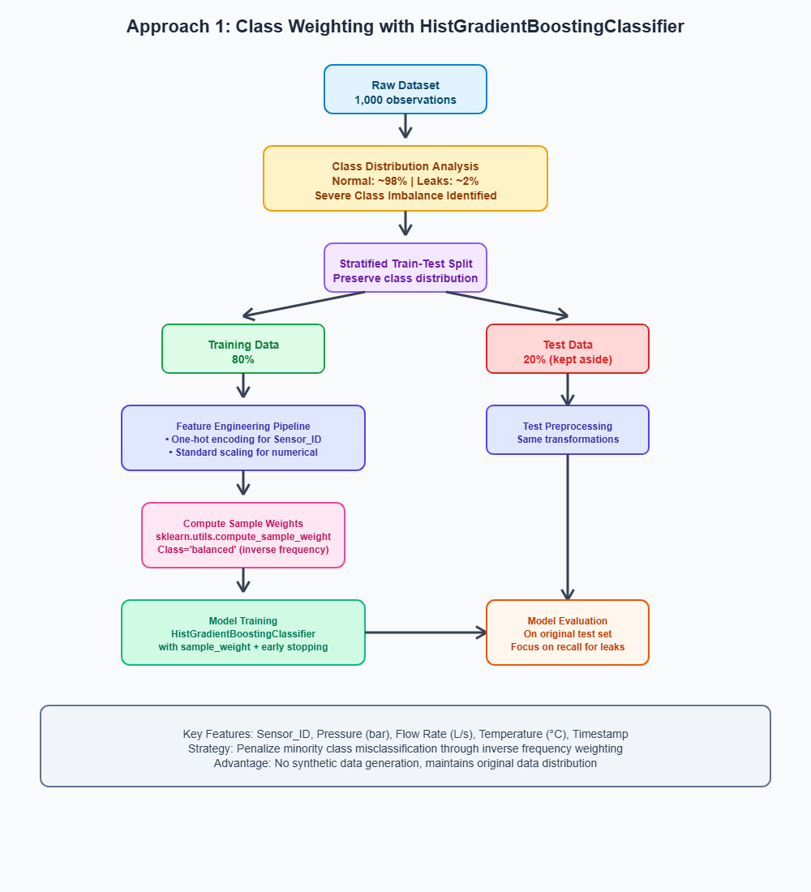
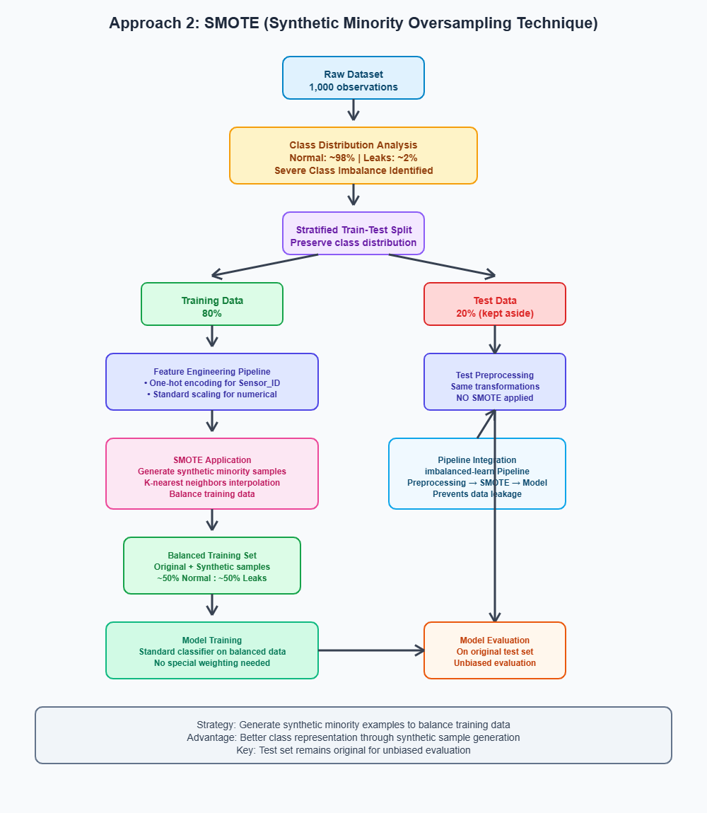

# Imbalanced-Data Problem
A machine learning project focused on detecting leaks in pipeline systems using imbalanced supervised classification techniques. This project demonstrates two effective approaches for handling class imbalance: class weighting and synthetic oversampling (a special case of Data Augmentation).

## Problem Statement

**Dataset:** Water pipeline sensor data with 1,000 observations 
Source: <a href="https://www.kaggle.com/datasets/ziya07/water-leak-dataset">kaggle: Water Leak Dataset</a> 
**Target Variable:** Leak Status (binary classification) 
**Challenge:** Severe class imbalance (~98% normal operations, ~2% leaks) 
**Objective:** Maximize leak detection while minimizing false alarms

## Features Used

**Sensor_ID:** Categorical identifier for different sensors  
**Pressure (bar):** Water pressure measurements  
**Flow Rate (L/s):** Water flow rate measurements  
**Temperature (°C):** Water temperature readings  
**Timestamp:** Time-series information (for potential temporal analysis)  

## Methodology

### Approach 1: Class Weighting with HistGradientBoostingClassifier
**Strategy:** 

Use inverse class frequency weights to balance the learning process 

**Implementation:** 

Computed balanced sample weights using sklearn.utils.compute_sample_weight 
Applied weights during model training to penalize misclassification of minority class 
Used HistGradientBoostingClassifier with early stopping 

**Preprocessing Pipeline:**

One-hot encoding for categorical features (Sensor_ID) 
Standard scaling for numerical features 
Stratified train-test split to preserve class distribution 

### Approach 2: SMOTE (Synthetic Minority Oversampling Technique)

**Strategy:** 

Generate synthetic examples of minority class to balance training data 

**Implementation:**

Applied SMOTE after preprocessing to create synthetic leak examples 
Maintained original test set for unbiased evaluation 
Used imbalanced-learn pipeline integration 

## Usage
<uo>
<li>Clone the repository</li>
<li>Install dependencies: <code>pip install -r requirements.txt</code></li>
<li>Run the notebook: jupyter notebook "Imbalanced Supervised Classification.ipynb"</li>
</uo>

## Documentation
*Flowcharts generated with AI assistance for clear visual communication of the data processing pipelines.*